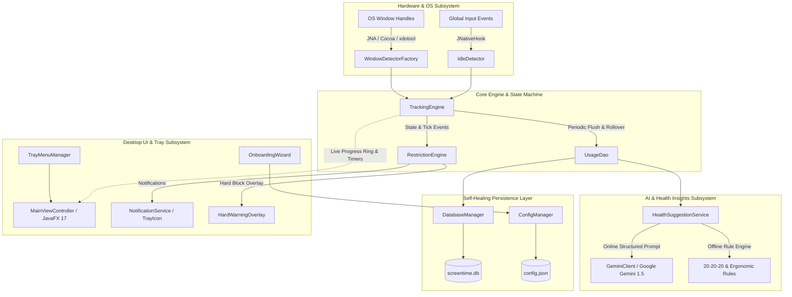

# ScreenTime Monitor ⏱️

[](https://openjdk.org/)
[](https://openjfx.io/)
[](https://www.sqlite.org/)
[](https://ai.google.dev/)
[](https://maven.apache.org/)
[](https://github.com/SadeeshaJayaweera/screentime-monitor)
[]()
[](LICENSE)

> **ScreenTime Monitor** is an enterprise-grade, privacy-first, cross-platform desktop application designed to track active computer usage, enforce mindful screen limits, mitigate digital fatigue, and provide intelligent ergonomic health insights powered by local heuristic engines and Google Gemini AI.

---

## 📖 Table of Contents

- [The Problem & Motivation](#-the-problem--motivation)
- [Application Architecture](#-application-architecture)
- [Tech Stack & Technical Choices](#-tech-stack--technical-choices)
- [Key Features](#-key-features)
- [Privacy & Local-First Philosophy](#-privacy--local-first-philosophy)
- [Database Schema & Persistence](#-database-schema--persistence)
- [Getting Started & Installation](#-getting-started--installation)
- [Native Packaging (jpackage)](#-native-packaging-jpackage)
- [Configuration & Environment](#-configuration--environment)
- [Platform-Specific Notes & Permissions](#-platform-specific-notes--permissions)
- [Automated Testing & QA](#-automated-testing--qa)
- [License](#-license)

---

## 🎯 The Problem & Motivation

### Why Was ScreenTime Monitor Developed?

1. **The Desktop Screen Time Blindspot**:
   While modern mobile operating systems (iOS Screen Time, Android Digital Wellbeing) feature built-in usage tracking and downtime reminders, desktop operating systems (macOS, Windows, Linux) have historically lacked unified, privacy-respecting, and ergonomic screen-limit tools.
2. **Digital Eye Strain & Sedentary Fatigue**:
   Continuous, uninterrupted computer work causes Computer Vision Syndrome (CVS), cervical neck stiffness, and mental fatigue. Knowledge workers often lose track of continuous hours spent staring at monitors without micro-breaks.
3. **The Privacy Problem with Commercial Trackers**:
   Most commercial time trackers (RescueTime, Toggl, Hubstaff) rely on cloud telemetries, upload user window titles and keystroke metrics to third-party servers, and impose subscription fees.
4. **The Solution: ScreenTime Monitor**:
   - **100% Local-First**: All activity history is stored locally in an embedded SQLite database (`screentime.db`). No personal window or keystroke telemetry ever leaves your machine.
   - **Health-Centric Rather Than Punitive**: Integrates progressive threshold alerts (50%, 75%, 90%, 100%), temporary extensions, and the clinical **20-20-20 optical fatigue rule**.
   - **AI-Enhanced Ergonomic Coaching**: Synthesizes daily habits with **Google Gemini 1.5** (or an offline heuristic engine fallback) to deliver actionable posture, hydration, and break recommendations.

---

## 🏗️ Application Architecture

ScreenTime Monitor follows a modular, decoupled, event-driven architecture built on clean OOP principles, defensive concurrency, and resilient self-healing subsystems.



### Module Breakdown

| Package | Key Classes | Responsibility |
|---|---|---|
| [`com.screentime.core`](file:///Users/macboookpro/screentime-monitor/src/main/java/com/screentime/core) | `TrackingEngine`, `IdleDetector`, `WindowDetector`, `TrackingSession` | Continuous 5-second polling loop, OS window querying, global keyboard/mouse activity tracking, midnight session boundary splitting. |
| [`com.screentime.data`](file:///Users/macboookpro/screentime-monitor/src/main/java/com/screentime/data) | `DatabaseManager`, `UsageDao`, `AppUsage`, `DailyUsageSummary` | SQLite connection pooling, automatic schema migrations, self-healing corruption recovery, atomic upsert aggregations. |
| [`com.screentime.restriction`](file:///Users/macboookpro/screentime-monitor/src/main/java/com/screentime/restriction) | `RestrictionEngine`, `RestrictionConfig`, `HardWarningOverlay` | Progressive daily warning thresholds, extension allowance evaluation, 5-minute reminder cadence, full-screen blocking overlay. |
| [`com.screentime.notifications`](file:///Users/macboookpro/screentime-monitor/src/main/java/com/screentime/notifications) | `NotificationService`, `NotificationManager`, `NotificationLevel` | Native system tray message dispatching with headless and fallback logging support. |
| [`com.screentime.ai`](file:///Users/macboookpro/screentime-monitor/src/main/java/com/screentime/ai) | `HealthSuggestionService`, `GeminiClient`, `HealthAdvisorOutput` | Asynchronous Google Gemini 1.5 REST client, fallback offline rule heuristics (20-20-20 rule, posture checks). |
| [`com.screentime.config`](file:///Users/macboookpro/screentime-monitor/src/main/java/com/screentime/config) | `ConfigManager`, `AppConfig`, `AutostartManager` | Thread-safe JSON configuration persistence, cross-platform OS autostart registration (LaunchAgents, Registry, .desktop). |
| [`com.screentime.ui`](file:///Users/macboookpro/screentime-monitor/src/main/java/com/screentime/ui) | `MainViewController`, `ProgressRing`, `TrayMenuManager`, `ExtensionDialog` | Dark-theme glassmorphic JavaFX 17 dashboard, custom vector SVG circular progress ring, historical charting, tray menu. |
| [`com.screentime.ui.onboarding`](file:///Users/macboookpro/screentime-monitor/src/main/java/com/screentime/ui/onboarding) | `OnboardingWizard`, `OnboardingModel` | 7-step first-run wizard guiding users through limits, thresholds, idle sensitivity, and AI setup with step validation. |

---

## 💻 Tech Stack & Technical Choices

| Technology | Version | Purpose & Rationale |
|---|---|---|
| **Java (JDK)** | `17 LTS` | Modern LTS Java runtime leveraging `record` classes, switch expressions, text blocks, and `java.net.http.HttpClient`. |
| **JavaFX** | `17.0.10` | Cross-platform GPU-accelerated UI framework with clean separation of layout (`FXML`), styles (`CSS`), and controllers. |
| **SQLite JDBC** | `3.45.1.0` | Embedded, zero-configuration relational database engine for lightweight, serverless local storage. |
| **JNativeHook** | `2.2.2` | Global low-level native keyboard and mouse event listener for accurate system-wide idle detection without polling CPU overhead. |
| **JNA & Platform** | `5.14.0` | Java Native Access for direct platform C/C++ API interop (`user32.dll`, Carbon/Cocoa, X11) without writing custom JNI C code. |
| **Google Gson** | `2.10.1` | High-performance JSON serialization and deserialization for settings and Gemini AI structured payloads. |
| **Logback / SLF4J** | `1.5.3 / 2.0.12` | Production-grade structured logging with colorized console output and rolling file appenders. |
| **JUnit 5 Jupiter** | `5.10.2` | Automated testing framework with temporary directory fixtures (`@TempDir`) for comprehensive DAO and engine unit tests. |
| **Maven Shade** | `3.5.2` | Packaging plugin creating a standalone runnable fat JAR with shaded dependencies and manifest transformers. |

---

## 🌟 Key Features

### 1. Accurate Cross-Platform Activity Tracking
- **Multi-OS Window Detectors**: Automatically determines active foreground applications using `GetForegroundWindow` / `GetWindowText` (Windows), AppleScript / Cocoa (macOS), and `xdotool` (Linux).
- **Intelligent Hardware Idle Detection**: Differentiates between active screen work and idle time (stepping away from desk, reading static documents) using global mouse/keyboard activity with a configurable threshold (default: 60s).
- **Midnight Day Rollover**: Seamlessly splits active sessions spanning 23:59:59 → 00:00:00 into their respective calendar dates without losing seconds or misattributing usage.
- **60-Second Persistence Snapshots**: Flushes running in-memory session totals to SQLite every 60 seconds to safeguard against OS crashes or sudden shutdowns.

### 2. Intelligent Screen Time Limits & Restrictions
- **Customizable Daily Goals**: Set daily active screen time targets (e.g. 4h, 6h, 8h).
- **Progressive Multi-Tier Warning Thresholds**: Receive non-intrusive native notifications when crossing key milestones (e.g. 50%, 75%, 90%, 100% of daily limit).
- **One-Off Daily Extensions**: Need extra time to finish a critical task? Request temporary extensions (+15m, +30m, +60m) governed by strict configurable daily caps (e.g. max 3 extensions or max 120 minutes total).
- **Escalated Post-Limit Reminders**: Emits persistent reminders every 5 minutes once the daily limit is exhausted.
- **Optional Hard Warning Overlay**: When enabled, presents an always-on-top full-screen JavaFX alert encouraging users to step away.

### 3. AI-Powered Health & Ergonomic Coaching
- **Google Gemini 1.5 Integration**: When configured with a Gemini API key, sends aggregated daily screen time metrics and top application distributions to receive personalized health assessments, fatigue concerns, and actionable ergonomic advice.
- **Offline Heuristic Rules Engine**: Functions 100% offline out-of-the-box using built-in clinical wellness rules:
  - **20-20-20 Rule**: Prompts users to look at an object 20 feet away for 20 seconds every 20 minutes of continuous focus.
  - **Cervical & Posture Prompts**: Suggests neck stretches, shoulder rolls, and ergonomic monitor height adjustments based on prolonged screen duration.

### 4. Sleek Dark-Mode Desktop UI
- **Modern Design Tokens**: Styled with custom CSS tokens inspired by Tailwind Slate palettes (`#0b0f19` background, `#1e293b` cards, `#38bdf8` cyan accents).
- **Dynamic Circular Gauge (`ProgressRing`)**: Custom SVG-style arc gauge transitioning colors from Cyan (`<75%`), Amber (`75-90%`), to Crimson Red (`>=90%`).
- **Historical Analytics**: Interactive bar charts and historical data tables supporting 7-day, 14-day, and 30-day usage trends.
- **Background Tray Presence**: Closes to system tray automatically; right-click context menu enables quick dashboard access, tracking pause/resume, instant extension requests, and graceful exit.

### 5. First-Run 7-Step Onboarding Wizard
- Step 1: Welcome & Privacy Commitment (explicit reassurance that no data leaves the machine).
- Step 2: Daily Screen Time Limit selection with presets (4h, 6h, 8h) and custom inputs.
- Step 3: Warning Threshold percentage management (50, 75, 90, 100%).
- Step 4: Idle Detection Sensitivity configuration.
- Step 5: Extension Policy & Daily Caps setup.
- Step 6: Optional Google Gemini API key configuration.
- Step 7: Final Review & Confirmation summary card.

### 6. System Autostart on Boot
- Native background launch configuration:
  - **macOS**: `~/Library/LaunchAgents/com.screentime.monitor.plist`
  - **Linux**: `~/.config/autostart/screentime-monitor.desktop`
  - **Windows**: `HKCU\Software\Microsoft\Windows\CurrentVersion\Run` registry entry.

---

## 🔒 Privacy & Local-First Philosophy

ScreenTime Monitor is strictly **local-first**:
1. **No External Network Calls by Default**: The core tracking engine, SQLite database, restriction monitor, and heuristic rules engine operate entirely offline.
2. **Zero Telemetry / Zero Analytics**: We do not collect crash reports, usage statistics, or behavioral data.
3. **Isolated AI Payloads**: If Google Gemini integration is enabled, only high-level summary statistics (e.g. "Total active time: 5h 20m, Top apps: IDE (3h), Browser (2h)") are transmitted directly to the official Google Gemini endpoint (`generativelanguage.googleapis.com`). No window contents, keystrokes, or document paths are ever captured or sent.

---

## 🗄️ Database Schema & Persistence

All records are stored in a local SQLite database (`screentime.db`) located in the user's application data directory.

```sql
-- Daily active and idle aggregates
CREATE TABLE daily_usage (
    date TEXT PRIMARY KEY,
    total_active_seconds INTEGER NOT NULL DEFAULT 0,
    total_idle_seconds INTEGER NOT NULL DEFAULT 0
);

-- Per-application usage breakdown
CREATE TABLE app_usage (
    id INTEGER PRIMARY KEY AUTOINCREMENT,
    date TEXT NOT NULL,
    app_name TEXT NOT NULL,
    seconds_used INTEGER NOT NULL DEFAULT 0,
    UNIQUE(date, app_name)
);

-- Individual window tracking sessions
CREATE TABLE sessions (
    id INTEGER PRIMARY KEY AUTOINCREMENT,
    date TEXT NOT NULL,
    app_name TEXT NOT NULL,
    start_time TEXT NOT NULL,
    end_time TEXT NOT NULL,
    duration_seconds INTEGER NOT NULL
);

-- Granted screen time extensions audit log
CREATE TABLE limit_extensions (
    id INTEGER PRIMARY KEY AUTOINCREMENT,
    date TEXT NOT NULL,
    requested_minutes INTEGER NOT NULL,
    requested_at TEXT NOT NULL,
    reason TEXT
);

-- Auxiliary application settings
CREATE TABLE settings (
    key TEXT PRIMARY KEY,
    value TEXT NOT NULL
);
```

### Self-Healing Recovery
If the database file encounters physical corruption (e.g. unexpected power outage), `DatabaseManager` automatically:
1. Detects the `SQLITE_CORRUPT` error during connection validation.
2. Backs up the damaged file to `screentime.db.corrupted.<timestamp>`.
3. Instantiates a clean database with all schemas, tables, and indices regenerated seamlessly.

---

## 🚀 Getting Started & Installation

### Prerequisites
- **Java JDK 17 or higher** (OpenJDK, Eclipse Temurin, Homebrew, etc.)
- **Apache Maven 3.8+**
- **Git**

### 1. Clone & Build
```bash
# Clone repository
git clone https://github.com/SadeeshaJayaweera/screentime-monitor.git
cd screentime-monitor

# Run all automated tests
mvn clean test

# Run directly in development mode
mvn javafx:run
```

### 2. Package Standalone Fat JAR
```bash
# Package shaded uber-jar
mvn clean package

# Run the packaged fat JAR
java -jar target/screentime-monitor-1.0.0-SNAPSHOT.jar
```

### 3. CLI Diagnostics Mode
Run non-graphical diagnostics to verify database paths, configuration integrity, and active window detector:
```bash
java -jar target/screentime-monitor-1.0.0-SNAPSHOT.jar --info
```

---

## 📦 Native Packaging (`jpackage`)

To create native OS-specific desktop installers bundled with a dedicated runtime:

### macOS (.dmg)
```bash
chmod +x scripts/package-mac.sh
./scripts/package-mac.sh
# Output: dist/mac/ScreenTime Monitor-1.0.0.dmg
```

### Windows (.msi)
```cmd
scripts\package-win.bat
:: Output: dist\win\ScreenTime Monitor-1.0.0.msi
```

### Linux (.deb)
```bash
chmod +x scripts/package-linux.sh
./scripts/package-linux.sh
# Output: dist/linux/screentime-monitor_1.0.0_amd64.deb
```

---

## ⚙️ Configuration & Environment

### App Data Directory Paths

| Operating System | Path |
|---|---|
| **macOS** | `~/.screentime-monitor/` |
| **Linux** | `~/.screentime-monitor/` |
| **Windows** | `%APPDATA%\ScreenTimeMonitor\` |

### Environment Variables & System Properties

- **`GEMINI_API_KEY`**: Set your Google Gemini API key via environment variable:
  ```bash
  export GEMINI_API_KEY="your-gemini-api-key-here"
  ```
- **`-Dgemini.api.key`**: Alternatively pass as a JVM system property:
  ```bash
  java -Dgemini.api.key="your-api-key" -jar target/screentime-monitor-1.0.0-SNAPSHOT.jar
  ```

---

## ⚠️ Platform-Specific Notes & Permissions

### macOS
- **Accessibility Permissions**: macOS requires accessibility authorization for window title queries and global input tracking.
- **Grant Permissions**: Navigate to **System Settings** → **Privacy & Security** → **Accessibility** and enable **ScreenTime Monitor** (or your Terminal/IDE during development).

### Linux
- **X11 vs Wayland**: Under X11, window detection runs natively. For Wayland sessions, ensure `xdotool` is installed (`sudo apt install xdotool`) or XWayland compatibility is enabled.
- **Notification Daemon**: Ensure `dunst`, `notify-osd`, `mako`, or GNOME Shell notification daemon is active.

### Windows
- **System Tray Pinned Icon**: Windows often hides background tray icons in the overflow chevron (`^`). Drag the icon onto the main taskbar tray to keep it visible.

---

## 🧪 Automated Testing & QA

ScreenTime Monitor maintains a comprehensive test suite covering core domain logic, concurrency, database transactions, and UI models:

```bash
mvn clean test
```

### Test Coverage Summary (46 Unit Tests)
- `AutostartManagerTest`: Executable path resolution and OS autostart registration across platforms.
- `ConfigManagerTest`: JSON serialization, default configuration values, and API key resolution hierarchy.
- `DatabaseManagerTest`: SQLite connection initialization, schema integrity, and automated migrations.
- `HealthSuggestionServiceTest`: Offline heuristic wellness suggestions, optical 20-20-20 rule validation.
- `IdleDetectorTest`: Hardware inactivity timeout evaluation and manual input event resets.
- `NotificationServiceTest`: Tray message dispatching, severity level mapping, and headless fallback handling.
- `OnboardingModelTest`: Step-by-step input validation rules across all 7 onboarding stages.
- `RestrictionEngineTest`: Warning threshold triggers, duplicate suppression, and daily extension cap enforcement.
- `TimeFormatUtilsTest`: Time formatting utilities for seconds, minutes, and multi-hour intervals.
- `TrackingEngineTest`: 5-second polling loop, active/idle transitions, pause/resume, and listener notifications.
- `TrackingEnginePersistenceTest`: Live session flushing to SQLite and midnight rollover persistence.
- `TrackingSessionTest`: Duration computation and multi-day midnight splitting accuracy.
- `UsageDaoTest`: Atomic session insertion, daily aggregates upsert, top apps ranking, and date range querying.
- `WindowDetectorFactoryTest`: Runtime OS detector instantiation.

For complete manual end-to-end testing procedures, see [TESTING.md](file:///Users/macboookpro/screentime-monitor/TESTING.md).

---

## 📄 License

This project is licensed under the **Apache License 2.0**. See the [LICENSE](LICENSE) file for details.